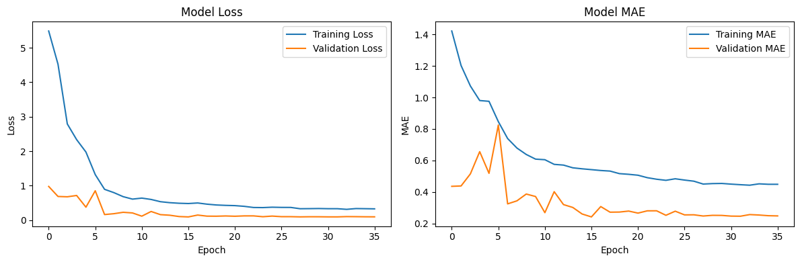

# WRP - Weight from Regression based Prediction
WRP (pronunciato "WARP") è un modello in grado di predirre il peso di un gatto basandosi su diversi dati come il tipo di alimentazione, dimensioni, sesso, razza e molto altro.


**struttura della repository**
```c
./
├── data/                                //  dati di training e testing
│   ├── test_set.csv
│   └── training_set.csv
├── img/                                 // immagini e grafici generati
├── models/                              // componenti dei modelli AI 
│   └── {nome_modello}/
│       ├── feature_info.pkl             // dati processati dall'encoder (debug)
│       ├── preprocessor.pkl             // una componente dell'encoder (debug)
│       ├── {nome_modello}-encoder.pkl   // l'encoder che processa i dati per il modello
│       └── {nome_modello}.keras         // il modello in se
├── notebooks/                           // codice guidato da commenti e markdown della 
|   |                                    // struttura dei modelli
│   └── {nome_modello}.ipynb
├── out/                                 // risultati delle previsioni sul test_set.csv
│   └── risultati-{nome_modello}.csv
├── README.md
└── requirements.txt                     // dipendenze usate
```

# Come abbiamo approcciato il problema
Data la composizione del dataset e l'obbiettivo di prevedere un valore
basandosi su diversi valori correlati tra di loro, questo sembra il caso
ideale in cui usare un modello regressivo.

La prima cosa che è saltata all'occhio è stata la presenza di colonne
con dati testuali, i quali non sono processabili da un modello se non
prima codificati in qualche modo in un valore numerico o vettore (array).
Per risolvere questo problema abbiamo deciso di creare un Transformer che
si occupa di processare i dati in un formato che `wrp` possa usare. 

## Preprocessing

- I valori **booleani** non vengono processati perche rappresentano chiaramente vero e falso
  > Viene fatto un controllo di integrità sui valori per assicurarsi che siano
  > effetivamente numeri interi 1 e 0

- I dati **numerici** vengono normalizzati usando uno `StandardScaler`, il che trasforma tutti i valori in modo da avere una distribuzione centrata sullo 0 e con valori nell'interallo [-1,1]

- I dati **testuali** vengono convertiti in colonne usando `OneHotEncoder` che in sintesi
trasforma una colonna di diversi valori testuali in piu colonne di valori booleani.

    **Esempio:**  
    La colonna `sesso` ha come possibili valori "maschio" e "femmina",  
    dopo che il dataset viene processato dal `OneHotEncoder`
    la colonna `sesso` viene rimpiazzata dalle **colonne** `maschio` e `femmina` con valori possibili 1 e 0 (true/false)

## Architettura
`wrp` è fromato da diversi layer `Dense` per l'estrazione delle informazioni,che diventano sempre piu piccoli progressivamente
per far si che il modello sia in grado di sintetizarre e assorbire le
informazioni gradualmente.

Per evitare di andare in overfitting abbiamo incluso anche diversi
layer `Dropout` in modo che i parametri del modello siano piu dinamici
(visto che Dropout per design spegne dei neuroni in modo casuale, il 
che obbliga il modello ad adattarsi per non dipendere da neuroni 
specifici) 

Layer (type)                    | Output Shape          | Param #
--------------------------------|-----------------------|--------------
dense (Dense)                   | (None, 256)           |         5,888 
dropout (Dropout)               | (None, 256)           |             0
dense_1 (Dense)                 | (None, 128)           |        32,896
dropout_1 (Dropout)             | (None, 128)           |             0
dense_2 (Dense)                 | (None, 64)            |         8,256
dropout_2 (Dropout)             | (None, 64)            |             0
dense_3 (Dense)                 | (None, 32)            |         2,080
dropout_3 (Dropout)             | (None, 32)            |             0
dense_4 (Dense)                 | (None, 16)            |           528
dense_5 (Dense)                 | (None, 1)             |            17

**Total params**: 148,997 (582.02 KB)

Questa architettura ha permesso di otterere buoni risultati durante il training

## Training

Durante il training sono state usate 2 funzioni di perdita:
- `MeanSquaredError` (MSE) : perchè reagisce in modo percettibile anche a piccoli errori
- `MeanAbsoluteError` (MAE) : (solo come monitoraggio) perchè permette di capire meglio a quanti kili corrisponde l'errore 

Durante il training abbiamo usato pure diversi callback per evitare l'overfitting:
- `EarlyStopping`: per fermare il training quando il modello smette di migiorare (e ripristina i parametri migliori)
- `ReduceLROnPlateau`: per cercare di aiutare il modello se per 10 epoche non migliora

```py
history = model.fit(
    x=X_train,
    y=y_train,
    validation_data=(X_test, y_test),
    epochs=200,
    batch_size=16,
    verbose=1,
    callbacks=[
        EarlyStopping(
            monitor='val_loss',
            patience=20,
            restore_best_weights=True
        ),
        ReduceLROnPlateau(
            monitor='val_loss',
            factor=1e-1,
            patience=10,
            min_lr=1e-6
        )
    ],
)
```


**Risultati di validazione performance**

MSE    | MAE    | R²     | MAPE
-------|--------|--------|-------
0.1040 | 0.2555 | 0.9244 | 4.27%

**Loss durante il training** (_ideale_: costante discesa senza spike frequenti)  


**Distribuzione dell'errore** (_ideale_: molto concentrato sullo 0)  


# wrp-2
Guardando meglio i dati ci siamo accorti di valori mancanti, e dati
assurdi (es. peso alla nascita 2600Kg), quindi dopo aver creato `wrp-1` 
in modo da poter analizzare dati completi, la sfida con `wrp-2` è stata 
quella di adattarsi ai dati in entrata ed essere in grado di 
**completare dati mancanti in modo intelligente**.

> [!NOTE]  
> `wrp-1` era gia in grado di riempire alcuni campi, ma usando semplicemente
> la mediana dei valori nella stessa colonna.
> L'obbiettivo di `wrp-2` è quello di basarsi su tutto quello che sa sui gatti
> per determinare un valore appropriato.

## Modifiche al `DataEncoder`
`wrp-2` necessita di un encoder molto piu potente per riuscire a gestire questi
dati mancanti e per questo la sua architettura è divisa in 3 parti 
principali, ciascuna formata da sotto modelli:
- **DataEncoder**  
  Sempre quello, si occupa di preparare i dati per la rete neurale
  - **KNNImputer**  
    Dopo aver studiato gatti con dati completi, questo trasformer 
    sfrutta l'algoritmo KNN per cercare di completare possibili buchi nel dataset
  - **OrdinalEncoder**  
    Trasforma i dati in entrata in vettori numerici per essere
    interpretati dal `KNNImputer`
  - **ColumnTransformer**  
    Lo stesso tranformer di `wrp-1` con gli stessi sub-transformer,
    allenati sui dati passati dal `OrdinalEncoder` e `KNNImputer`
    - **StandardScaler**
    - **OneHotEncoder**

# Architettura
La nuova architettura progettata per `wrp-2` è più profonda e complessa
per cercare di adattars bene ai dati imputati durante il processo
di preprocessing, e a possibili dati assurdi.
Per contro bilanciare questo aumento di layer `Dense` sono stati aggiunti
altrettanti layer `Dropout` per regolare il modello ed evitare che il 
modello si adatti in modo sbagliato ai dati in entrata
(memorizza e non impara)

Layer (type)              | Output Shape           |       Param #
--------------------------|------------------------|--------------
dense (Dense)             | (None, 1024)           |        25,600
dropout (Dropout)         | (None, 1024)           |             0
dense_1 (Dense)           | (None, 1024)           |     1,049,600
dropout_1 (Dropout)       | (None, 1024)           |             0
dense_2 (Dense)           | (None, 512)            |       524,800
dropout_2 (Dropout)       | (None, 512)            |             0
dense_3 (Dense)           | (None, 256)            |       131,328
dropout_3 (Dropout)       | (None, 256)            |             0
dense_4 (Dense)           | (None, 128)            |        32,896
dropout_4 (Dropout)       | (None, 128)            |             0
dense_5 (Dense)           | (None, 68)             |         8,772
dropout_5 (Dropout)       | (None, 68)             |             0
dense_6 (Dense)           | (None, 16)             |         1,104
dropout_6 (Dropout)       | (None, 16)             |             0
dense_7 (Dense)           | (None, 1)              |            17

**Total params**: 5,322,353 (20.30 MB)


**Risultati di validazione performance**

MSE    | MAE    | R²     | MAPE
-------|--------|--------|-------
0.0949 | 0.2414 | 0.9227 | 4.22%

**Loss durante il training** (_ideale_: costante discesa senza spike frequenti)  


**Distribuzione dell'errore** (_ideale_: molto concentrato sullo 0)  

